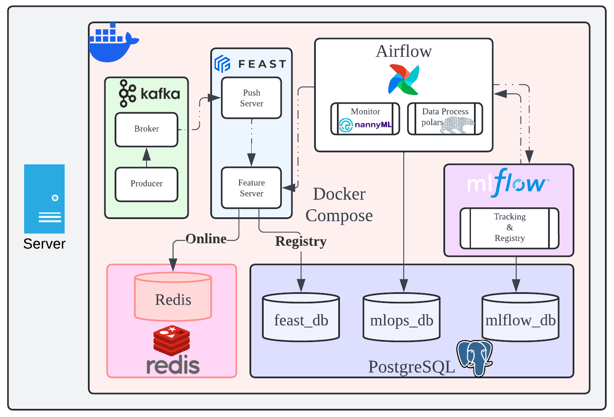

# mlops-onpremises-slim

> A template for a lightweight data pipeline and MLOps production environment in a on-premises server.

This template is designed for organizations that require a streamlined and efficient approach to data pipeline and deploying AI/ML models on-premises environment. It is ideal for scenarios involving lightweight batch processing and deploying a limited number of models.

The environment includes Airflow and MLflow with a PostgreSQL backend, each with its own dedicated database. This ensures data integrity and provides a robust foundation for managing workflows and model tracking.

For organizations seeking a comprehensive data pipeline and MLOps environment, this template can be extended by integrating Kubeflow, Hadoop, Hive, Apache Spark, Apache Kafka, and Feast. These additional components enable advanced data processing, distributed computing, and feature engineering capabilities.

## System Diagram

  
  
  

## Directory Structure

The project directory structure is as follows:

<pre>
.
├───docker
│   ├───airflow
│   ├───mlflow
│   └───postgres
│       └───entrypoint_initdb
└───mnt
    ├───airflow
    │   ├───dags
    │   │   ├───files
    │   │   ├───scripts
    │   │   │   
    │   │   └───sql
    │   │   
    │   ├───logs
    │   └───plugins
    ├───mlflow
    └───postgres
</pre>

Thank you for reading my work!